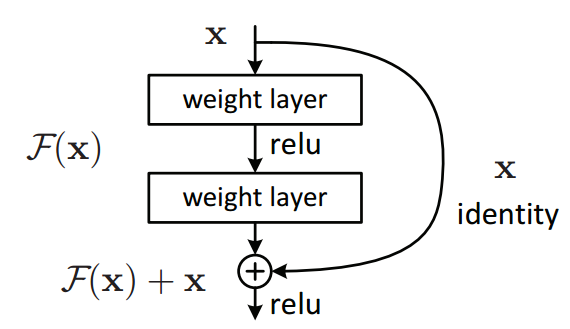

# Aperture

Modified residual network (ResNet) architecture trained on CIFAR-10 image classification dataset, with **total number of trainable parameters less than 5 million**.

## Introduction

A residual network (ResNet) architecture is any convolutional network with skipped connections. The key component in
ResNet models is a residual block that implements:

$$ ReLU(S(x) + F(x)) $$

<p align="center">
  
</p>

where $S(x)$ refers to the skipped connection and $F(x)$ is a *block* that implements `conv -> BN -> relu -> conv -> BN`;
here, “BN” stands for batch normalization. Chaining such blocks serially gives a deep ResNet. Primary hyperparameters (design variables)
in such architectures include:
- $N$, the number of residual layers
- $B$, the number of residual blocks in the $i^{th}$ residual layer
- $C_i$, the number of channels in the $i^{th}$ layer.
- $F_i$, the filter size in the $i^{th}$ layer.
- $K_i$, the kernel size in the $i^{th}$ skip connection.
- $P$, the pool size in the average pool layer.

The project also experiments with:
- Optimizers (SGD, SGD with Nesterov, Adam, Adadelta, Adagrad)
- Data Augmentation Strategies (Standard, Mixup)
- Learning Rates
- Batch Sizes
- Epochs

The best test accuracy of **94.12%** is achieved using **ResNet-22**, with total number of tranable parameters equal to 4,922,826. The execution logs for the experiments are located under `/out` directory.

## Usage

- Clone the repository

    ```bash
    git clone git@github.com:utsavoza/aperture.git
    ```

- Setup and activate the virtual environment

    ```bash
    python3 -m venv .
    source ./bin/activate
    ```

- Install the required dependencies from `requirements.txt`

    ```bash
    pip3 install -r requirements.txt
    ```

- Configure and execute `main.py`

    ```bash
    python3 main.py --model=resnet22_2 --num-workers=2 --optim=adadelta --lr=0.1
    ```

## Acknowledgements

The project makes use of and builds up on the [pytorch-cifar](https://github.com/kuangliu/pytorch-cifar) repository by [kuangliu](https://github.com/kuangliu) for training various ResNet
models on CIFAR-10 from scratch. The project also utilizes procedures from this [repository](https://github.com/facebookresearch/mixup-cifar10) for employing mixup data augmentation strategy.

## License

    Copyright (c) 2023 Utsav Oza

    Permission is hereby granted, free of charge, to any person obtaining a copy
    of this software and associated documentation files (the "Software"), to deal
    in the Software without restriction, including without limitation the rights
    to use, copy, modify, merge, publish, distribute, sublicense, and/or sell
    copies of the Software, and to permit persons to whom the Software is
    furnished to do so, subject to the following conditions:

    The above copyright notice and this permission notice shall be included in all
    copies or substantial portions of the Software.
